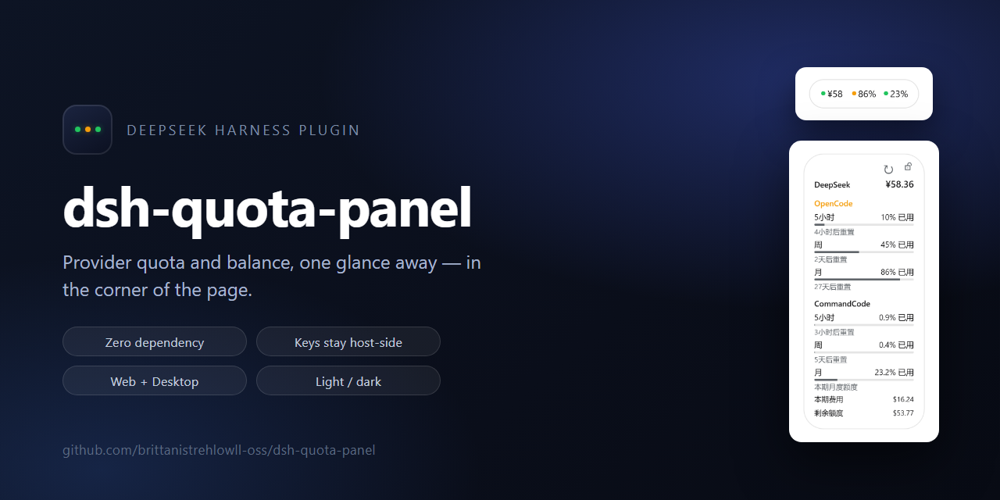
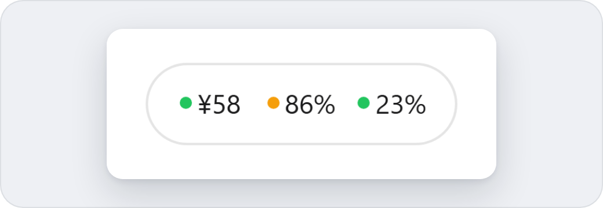
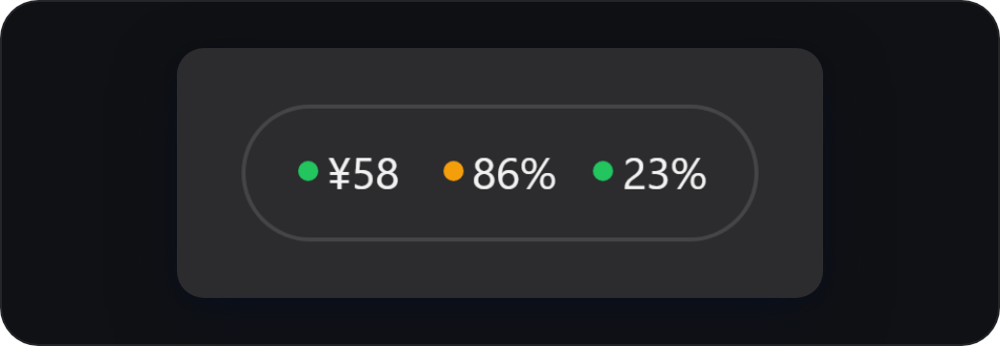
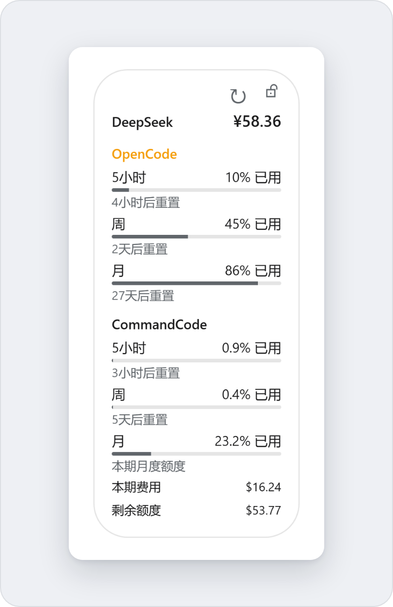
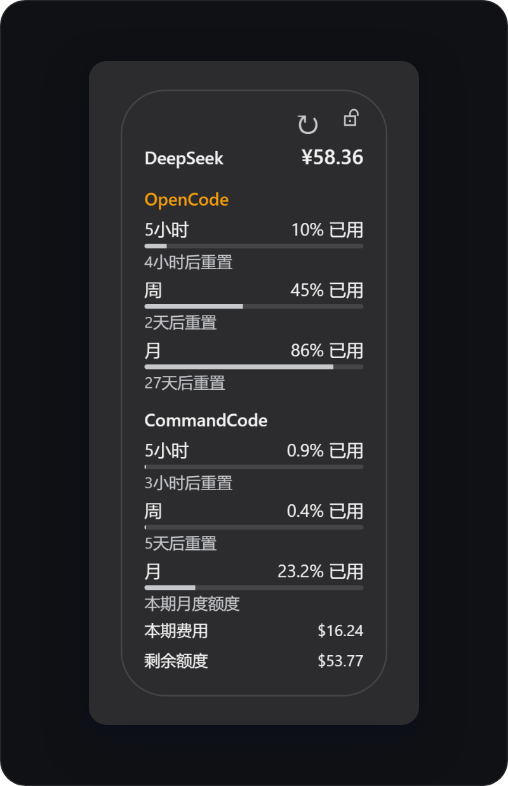
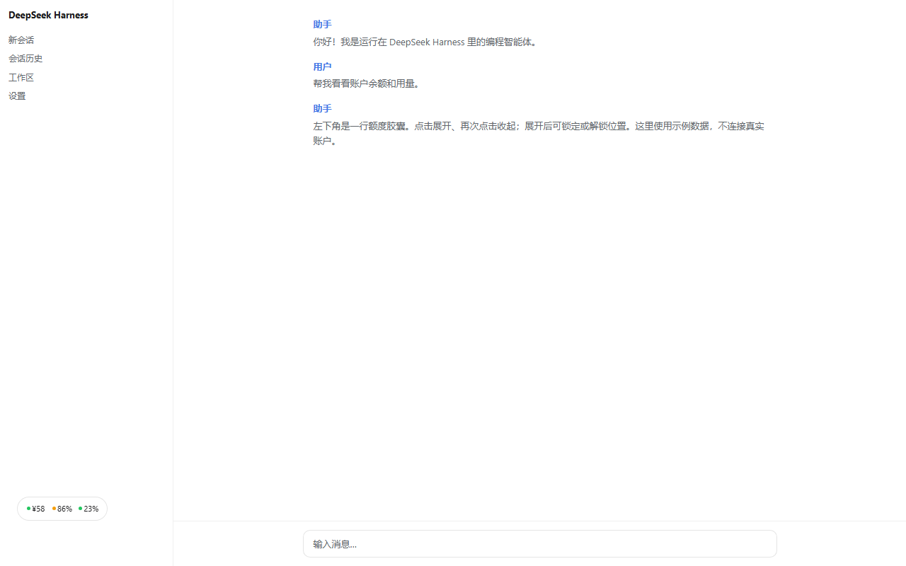
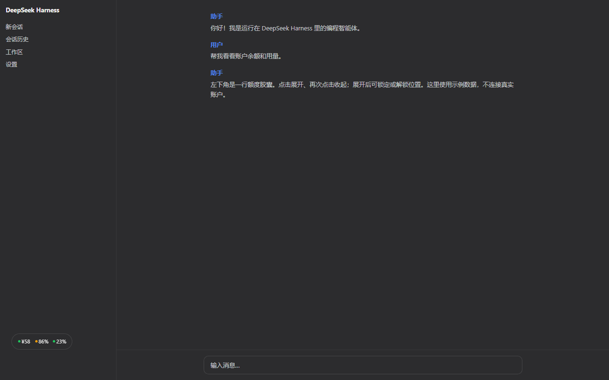

[**简体中文**](README.md) · [English](README.en.md)

[](https://github.com/brittanistrehlowll-oss/dsh-quota-panel/releases)
[](LICENSE)
[](https://github.com/topics/dsh-plugin)
[](#%E5%AE%89%E8%A3%85)
[](package.json)
[](#%E9%85%8D%E7%BD%AE)
[](https://github.com/brittanistrehlowll-oss/dsh-quota-panel/stargazers)

**DeepSeek Harness（DSH）的提供方额度 / 余额角标。** 页面左下角一行胶囊，扫一眼就知道还有多少钱、还剩多少额度；点开是一张完整卡片，再点一下收回一行。

零依赖宿主端插件：为每个配置的提供方注册一条服务端代理路由 `/api/quota/<id>` —— API Key 通过凭据系统在宿主侧解析，**绝不进入浏览器** —— 然后在页面注入这个原生组件。Web（`dsh web`）和官方 Electron 桌面版共用同一份实现，不依赖鲸息或任何其他插件。

## 界面

收起态：每个账户一对「状态点 + 数值」（如 `● ¥58 · ● 86% · ● 23%`），没有文字标签；只有出问题的那个账户自己的点会变色。金额取整数用于速览，精确值见展开与悬停。

| 浅色 | 深色 |
| --- | --- |
|  |  |

展开态：纵向排列各账户的余额与用量，五小时 / 周 / 月各自带进度条和重置时间；CommandCode 另显示本期费用与剩余额度。右上角是刷新按钮与独立的锁按钮。

| 浅色 | 深色 |
| --- | --- |
|  |  |

页面中的默认位置（左下角，自动避让底部入口，不进入正文）：

| 浅色 | 深色 |
| --- | --- |
|  |  |

可交互离线示例：[浅色](docs/demo.html) / [深色](docs/demo-dark.html)（`npm run demo` 生成的单文件页面，用浏览器直接打开即可；数据为离线模拟，不连接真实账户）。仓库里的示例图由 `npm run showcase` 从这条真实注入脚本里重新截取，`docs/verification/` 是回归测试产物。

## 特性

- **两种尺寸，同一个组件** —— 收起 128×34px，长宽比约 3.76；展开宽 168px（`--dsh-quota-width`）、高度随内容自适应（当前三账户约 382px），圆角两端、无阴影，从底边向上展开。
- **每个账户独立** —— 一个账户异常只染红它自己的状态点，不牵连其他账户。
- **「接口挂了」不等于「额度危险」** —— 两者不共用红色，见下表。
- **读数不编造** —— 缺失或非有限数值判定为数据异常，绝不折叠成 `0%`：「没读到数字」不能显示成「额度还很足」。
- **跟随产品主题** —— 完全由 Harness 设计 Token（`--dsw-alias-*`、`--dsw-static-*`、`--dsw-font-*`）驱动，token 缺失时有合理 fallback，不携带自己的配色。
- **可拖动、位置记忆、可锁定** —— 位置按浏览器持久化，窗口变化重新钳位，锁定后不再移动。
- **Web 与桌面同源** —— 宿主端载体中立：路由注册在 `connection` 的精确 Fetch 路由表上，Web 服务器与桌面 host 派发进同一张表。
- **零依赖、前端零密钥** —— 不引入任何 npm 依赖；浏览器只访问 `/api/quota/<id>`，凭据始终留在宿主侧。
- **键盘与无障碍** —— Enter/Space 开合、Tab 到锁按钮、Space 切换锁定、Esc 收起并回到主按钮；DOM 只用 `createElement`/`textContent` 构建。

## 刷新失败时

| 情况 | 状态点 | 数值 | 悬停提示 |
|---|---|---|---|
| 正常 | 实心 绿/琥珀/红 | 按接口返回 | 读数明细 |
| 刷新失败，但有历史读数 | **空心圈** | 保留上一次数值，灰字 | `数据更新于 15:32` + 失败原因 |
| 本次打开后从未取到 | 中性灰 | `—` | 失败原因 |

所以一次瞬时网络抖动不会再把你健康的 `¥58.36` 涂成红色的 `—`。默认每 5 秒自动刷新一次，页面隐藏时暂停；展开态的手动刷新不会改变展开状态，重复请求会合并。

## 安装

### Web（`dsh web`）

```sh
dsh plugin --profile web add "github:brittanistrehlowll-oss/dsh-quota-panel"
# 重启 `dsh web`（bundle 层在启动时生效）
```

包声明了 `dsh.bundle.patch`，因此 `dsh plugin add` 会把它自动激活为 profile 层。

### 桌面版（Electron `DeepSeek Harness.exe`）

桌面版**不能**用上面的包方式装：`dsh-desktop-host` 自带的 `config/desktop.cordis.patch.yml` 把 `web-startup` / `webserver` / `web-runtime` 三行全部禁用（前端走 `dsh-app://` + IPC 管道，不监听端口），所以插件如果 `inject: [webServer]` 就会永远停在「等待服务」状态、根本不加载。

插件 v0.8.0 起宿主端是**载体中立**的，桌面版按「profile 内相对路径行」安装：

```powershell
# 1) 把源码接到桌面 profile 里（junction 直连仓库，改码后重启即生效）
New-Item -ItemType Junction `
  -Path "$env:USERPROFILE\.dsh\profiles\desktop\plugins\quota-panel" `
  -Target "D:\deepseek\dsh-quota-panel"

# 2) 在 $DSH_HOME\profiles\desktop\cordis.patch.yml 写入插入行
#    （name 用相对 profile 的路径，inject 只留 credentials）
#    - insert:
#        - id: quota-panel
#          name: './plugins/quota-panel/lib/index.js'
#          inject: [credentials]
#          config: { refreshMs: 60000, providers: [ … ] }
```

然后**完全退出并重开桌面应用**（不是重载窗口）：桌面 host 在启动时一次性读取 profile 层，没有 CLI 的 live patch 监视器。`npm run verify:desktop <profileDir>` 会在不启动 Electron 的前提下，用真正的 `runDesktopHost` 起同一套组合并断言注入与三条路由的真实读数（最近一次在 DSH `0.1.5-rc.2` 上通过，见 `docs/verification/desktop-carrier-20260914.log`）。

桌面版为什么能工作：`/api/*` 由 `connection` 的精确 Fetch 路由表承载 —— Web 端由 connection 自己挂到 HTTP 服务器的 `/api` 前缀，桌面端由 host 把管道里的 `/api/*` 直接派发给同一张表；页面脚本则通过 `webserver/index-inject` 结构化注入行进入 index.html（两端都会 emit 同一事件）。所以一份注册同时服务两个载体，凭据依旧只在宿主侧解析。

## 配置

每个提供方是 `providers` 下的一项，内置三种渲染器：

| format | 接口返回形态 | 行显示 |
|---|---|---|
| `deepseek-balance` | `{ "balance_infos": [{ "currency", "total_balance" }] }` | 余额 `¥58.36` |
| `opencode-usage` | `{ "usage": { "rolling"\|"weekly"\|"monthly": { "percent", "resetsAt" } } }` | 最高窗口用量 `86%` |
| `command-cost` | `endpoint` 为 API **根**；宿主合并三个接口读数 | 本期费用 `$16.24` |

在 profile 的 `cordis.patch.yml` 中覆盖默认配置：

```yaml
- id: quota-panel
  config:
    refreshMs: 30000
    providers:
      - id: deepseek
        label: DeepSeek
        credential: DEEPSEEK_API_KEY
        endpoint: https://api.deepseek.com/user/balance
        format: deepseek-balance
        balanceTiers: { critical: 10, warn: 20, healthy: 50 }
      - id: opencode-go
        label: OpenCode Go
        credential: OPENCODE_GO_API_KEY
        endpoint: https://opencode.ai/zen/go/v1/usage
        format: opencode-usage
        windowLabels: { rolling: 五, weekly: 周, monthly: 月 }
        warnPercent: 70
        errorPercent: 90
      - id: command
        label: Command Code
        credential: COMMAND_API_KEY
        endpoint: https://api.commandcode.ai
        format: command-cost
        windowLabels: { fiveHour: 五, weekly: 周 }
        warnPercent: 70
        errorPercent: 90
        currency: USD
```

字段说明：

| 字段 | 含义 | 默认值 |
|---|---|---|
| `id` | 路由 id（`/api/quota/<id>`），`^[a-z0-9-]+$` | 必填 |
| `label` | 卡片上的提供方名称 | 必填 |
| `credential` | 凭据引用（`$DSH_HOME/.credentials.yaml` 或环境变量） | 必填 |
| `endpoint` | 额度 JSON 接口（`command-cost` 填 API 根），GET + `Authorization: Bearer <key>` | 必填 |
| `format` | 行渲染器 | `deepseek-balance` |
| `balanceTiers` | （deepseek-balance）`{critical, warn, healthy}` 分级阈值 | `{10, 20, 50}` |
| `lowBalance` | 旧版别名，等价于 `balanceTiers.warn` | — |
| `windowLabels` | （opencode-usage）`{rolling, weekly, monthly}`；（command-cost）`{fiveHour, weekly}` | 按界面语言 |
| `warnPercent` / `errorPercent` | （opencode-usage、command-cost）阈值 | 70 / 90 |
| `currency` | （command-cost）金额货币，三位 ISO 码 | `USD` |
| `refreshMs` | 自动刷新间隔，`5000 <= refreshMs <= 86400000` | 5000 |

配置校验是**严格**的：写了但不是合法数字（`NaN`、`Infinity`、字符串）会直接报错，而不是悄悄退回默认值；`warnPercent < errorPercent` 且都落在 `0..100`；`balanceTiers` 必须有序；`endpoint` 必须是 **https** —— 代理会把你的 API Key 作为 `Bearer` 头带上去，因此明文 `http` 只对本机回环地址开放（`localhost` / `127.0.0.1` / `::1`）。

### DeepSeek 余额分级

默认 `balanceTiers {critical: 10, warn: 20, healthy: 50}`：

| 余额 | 状态 | 次级信息 |
|---|---|---|
| `<= 10` | error（红点；展开名称告警） | 建议充值 |
| `10 < x <= 20` | warn（琥珀色） | 余额紧张 |
| `20 < x <= 50` | ok | 余额正常 |
| `> 50` | ok | 余额充足 |

### OpenCode 用量状态

`high = max(滚动, 每周, 每月)`：

| 用量 | 状态 |
|---|---|
| `< warnPercent` | ok（绿点） |
| `>= warnPercent` | warn（琥珀点） |
| `>= errorPercent` | error（红点） |

某个窗口的 `percent` 缺失或不是有限数值时，整行判定为**数据异常**，绝不折叠成 `0%`。

### Command Code 费用状态

`high = max(本周期消费占比, 五小时窗口, 周窗口)`：

| 读数 | 状态 |
|---|---|
| `< warnPercent` | ok（绿） |
| `>= warnPercent` | warn（琥珀） |
| `>= errorPercent` | error（红） |

月比例使用官方 `/alpha/usage/summary` 的 `totalMonthlyCredits` 与 `/alpha/billing/credits` 的 `credits.monthlyCredits`，在 `periodBasis=billing-period` 时按 `月度已消耗 / (月度已消耗 + 月度剩余)` 计算。充值和赠送额度不混入月比例；字段缺失显示 `—`。五小时、周比例来自 `windowLimits.used/cap`。本周期额度接口并不直接返回，由 `消费 + 剩余额度` 反推 —— GOAT 套餐实测为 `$16.24 + $53.77 = $70.01`。月重置日期接口未返回时不编造。

## 位置与拖动

收起和展开都可拖动，默认解锁：

- **拖动**可把它放到任意位置 —— 面板离开默认的左下角，跟随指针移动，并始终被约束在视口内（不会拖出屏幕）。
- 位置**按浏览器记住**（`localStorage`，键 `dsh.quota.pos`），下次打开自动恢复；窗口尺寸变化时会重新钳位回可视区。
- **单击**切换两种尺寸：按下后位移小于 4px 算点击，超过即判定为拖动（拖动结束时产生的那次 click 会被吞掉，不会误展开）。
- 展开后的锁按钮禁用拖动，不禁用开合；锁状态以 `dsh.quota.locked` 持久化。
- 解锁后在胶囊上**右键**可复位到默认左下角。
- 可选宿主的 `mountCompact` 挂载完整组件，保持所有样式；已有手动位置优先。无手动位置时可嵌入宿主，解锁拖动会把整个组件带出宿主。

## 安全

- API Key 仅由服务端通过 `ctx.credentials` 解析，只用于服务端到提供方的请求；浏览器只访问 `/api/quota/<id>`。
- 每条路由都返回统一包被：`{ ok: true, data }` 或 `{ ok: false, error: { code, status, message } }`，`code` 取 `credentials` / `upstream` / `timeout` / `network` / `invalid-body`。上游返回 HTML 错误页会在宿主侧被转成 `invalid-body`，页面脚本永远不会去解析非 JSON 正文。
- 路由即信任边界：它从不回显凭据，验证脚本会断言响应体里不含 Key。
- `endpoint` 必须是 https（回环地址例外），因为代理会以 Bearer 形式附上 Key。
- 注入的卡片只使用 `createElement`/`textContent` 构建 DOM，API 返回值绝不经过 `innerHTML`；刷新失败只体现在 `title` 悬停提示与空心状态点上，不进卡片正文。

## 更新日志

- **v0.8.0** — 宿主端改为载体中立：数据面注册到 `connection` 的精确 Fetch 路由表（Web 服务器与桌面 host 共用同一张 `/api` 表），页面脚本改为 `webserver/index-inject` 结构化注入行，不再依赖 `webServer`；只有 `connection` 缺失的老宿主才回退 `webServer.register` + `tapIndex`。插件现在能在官方 Electron 桌面版（无 HTTP 服务、`dsh-app://` + IPC）里工作。新增 `npm run verify:desktop`。
- **v0.7.0** — 紧凑胶囊与完整周期详情：收起 128×34px 单行读数，展开 168px 宽纵向详情；恢复周期进度与重置时间；独立初始位置随异步侧栏更新并避让底部入口。
- **v0.6.0** — 176px 紧凑极简双态胶囊，28/56px 高度；独立左下角定位、可拖动、持久化锁按钮；移除独立卡片及工具栏。有效危险读数不再被旧值覆盖，异常数值拒绝转换为 0，上游异常正文不再回显。新增真实鼠标/键盘、两态互斥和文字几何验证。CSS 随包发布。
- **v0.5.0** — 新增 Command Code（`command-cost`）行：本周期消费、请求/Token 计数、剩余额度，以及五小时 + 周窗口。收起与展开统一横向尺寸、统一 16px 圆角（左右边界不再跳）。刷新失败改为保留最后一次有效读数（`stale`、空心点、灰字），不再误报红色。服务端统一 `{ ok, data | error }` 响应包被；金额按接口返回的货币用 `Intl.NumberFormat` 渲染；`Esc` 收起；补 `aria-controls` 与 focus 环；配置校验补强；脚本共用 Chromium 探测；加 CI。修复 i18n 占位符从未被替换的 bug（界面曾显示 `当前最高占用 {h}%`）。
- **v0.4.0** — 任意位置拖动：胶囊即拖动把手（指针事件，触屏可用），位置按浏览器持久化并在下次打开恢复，视口钳位，卡片按空间自动翻转/贴边，右键复位。
- **v0.3.0** — 双尺寸：收起为极简胶囊（每账户独立状态点 + 电量式三色数值），点击展开完整卡片。
- **v0.2.0** — Harness 原生卡片：设计 Token 驱动、余额分级阈值、用量进度条。
- **v0.1.0** — 初版悬浮面板：服务端额度代理 + 页面角标。

## 本地开发

```sh
npm test              # 数据模型、配置、脚本语法和安全回归
npm run demo          # 重新生成 docs/demo.html + docs/demo-dark.html
npm run verify        # 无头浏览器：DOM/几何尺寸/stale 断言
npm run verify:dark   # 深色主题同上
npm run verify:drag   # 合成真实拖动，校验持久化/钳位/复位
npm run verify:route  # 离线路由契约，不读取真实凭据
npm run verify:desktop -- <profileDir>  # 桌面 host 组合探针（真 runDesktopHost，无 Electron）
npm run verify:package # 打包后**从 tarball 里**加载插件再校验
npm run screenshot    # 两态验收及 docs/verification/*.png 截图
npm run showcase      # 重新生成 assets/ 与 docs/images/ 里的项目页配图
npm run pack          # 产出 dist/dsh-quota-panel-<version>.tgz
npm run check         # test + demo + verify
```

`verify:package` 是发布门禁：先打包、解包，再从**解包出来的副本**里 import 插件，断言 `files` 白名单带齐了运行时真正要读的文件 —— 尤其是 `lib/plugin-integration-v1.js`（插件在 import 时从磁盘读它），只跑工作区副本的测试永远发现不了它漏发。

`verify:route` 默认仅离线 stub，绝不读取真实凭据；仅显式传入 `--live` 才尝试读取 Key 并调用线上接口。当前浏览器验收同时检查浅深色、鼠标拖动/锁定/解锁、刷新恢复、键盘、宿主挂载及文字不重叠，结果存于 `docs/verification/`。

`showcase` 是配图生成器而非门禁：它从 `docs/demo.html` 里真实注入的脚本上截图，所以 README 的图不会和实现脱节；hero 图用本机字体渲染，因此只在有桌面字体栈的机器上跑。

浏览器脚本会自动探测 Chrome / Chromium / **Edge**；可用 `CHROME_PATH` 或 `CHROME_BIN` 覆盖。

## License

MIT
